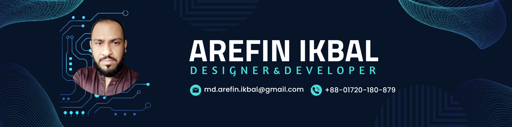

<h1 align="center">Hi there 👋 </h1>

###

My name is  MD. Arefin Iqubal Bhuiyan and I'm a Beginner Frontend Developer  from Dhaka,  Bangladesh.

###

✨ Creating Designs since 2024 📚 I'm currently learning ... 🎯 Goals: To Become a Mern Stack Developer.

###

<h2 align="left">I code and design with</h2>

###

 

  
  
  
  
  
  
  
  
  
  
  
  
  
  
  
  
  
  
  
  
  
  
  

###
<h2 align="left">All of My PSD to HTML Link are listed below:</h2>

###

- [Active-Box](https://md-arefin-ikbal.github.io/Active-Box/)

- [Beatles](https://md-arefin-ikbal.github.io/Beatles/)

- [Dreams](https://md-arefin-ikbal.github.io/Dreams/)

- [Marble](https://md-arefin-ikbal.github.io/Marble/)

- [Tiny-One](https://md-arefin-ikbal.github.io/Tiny-One/)

- [Veer](https://md-arefin-ikbal.github.io/Veer/)

###
<h2 align="left">🤝Connect With me!</h2>

###

  

###
<h2 align="left">📊My GitHub Stats:</h2>

 
 

###
